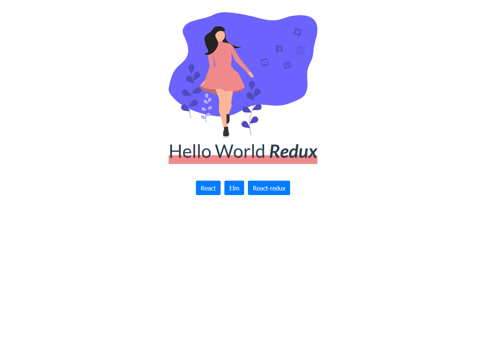

# Redux Hello World;

This is a simple React app with the sole aim of being refactored to use Redux. Pretty basic stuff. Ideal for Absolute Redux beginners.

  

## Directions

1. Clone the repo
   `git clone https://github.com/SafdarJamal/redux-helloworld.git`

2. Change directory
   `cd redux-helloworld`

3. Run the application
   `npm i && npm start`

4. Go on and refactor to use Redux!
